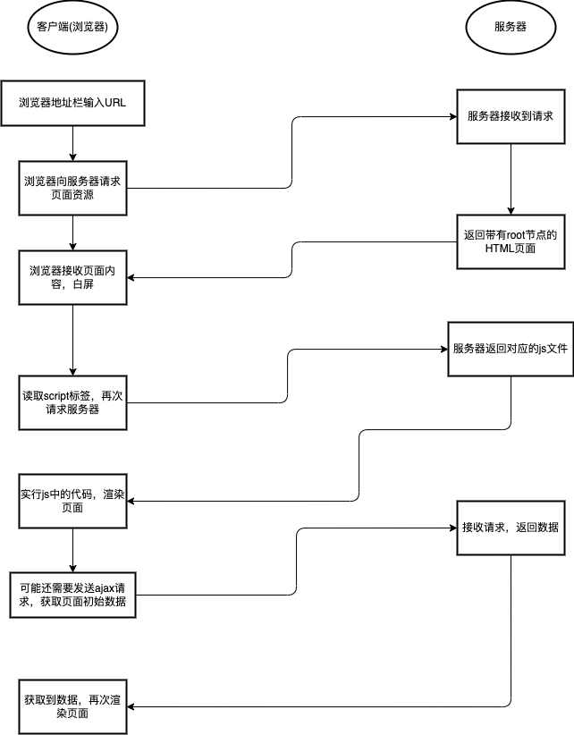

# 浅谈SSR

## 背景

随着业务的迭代发展，最近需要接手一个SSR项目，因为不是太了解这一块的逻辑概念，故写下这篇文章，主要是大概梳理一下开发流，另外通过梳理发现项目中是否存在可以优化的地方，也希望更多的人理解和掌握这门技术

## 什么是SSR

服务端渲染生成HTML片段，返回给浏览器，浏览器进行渲染页面，将不具有交互能力的HTML结构绑定上事件和状态，在客户端展示为具有完整交互能力的应用程序

服务端只负责首次渲染，（真正意义上，只有浏览器才能渲染页面，服务端只是生成HTML内容，返回给客户端，客户端接管页面交互，之后客户端切换路由时，直接通过JS代码来显示对应的内容，不再需要服务端渲染）

## 为什么要用SSR

### 需要更好的支持SEO

有利于SEO，其实就是有利于爬虫来爬你的页面，别人在使用一些搜索引擎的时候，网页的排行更靠前，流量越高

* 低级爬虫：只请求url，url返回什么就爬什么
* 高级爬虫：请求url，加载并执行JavaScript 脚本渲染页面，爬JavaScript 渲染后的内容

要想彻底解决这个问题只能服务端直出，改变不了别人就改变自己

### 需要更快的渲染

在SPA单页面应用下，所有的请求和渲染都是在浏览器端完成的，当我们访问的时候需要一个**白屏时间**等待(这个时间需要浏览器去请求一个可能包含`id="root"` 的html，请求并运行js文件，将虚拟dom转变为真实dom挂载到这个节点上)

而服务端渲染数据请求和html内容已经在服务端完成，浏览器只是接收到**完整的html进行渲染**即可，可以更快的看到渲染内容，在服务端完成数据请求肯定要比浏览器端效率更高

### SSR+SPA 体验升级

只实现SSR其实没啥意义，技术上没有任何发展和进步，否则SPA技术就不会出现

但是单纯的SPA又不够完美，所以最好的方案就是这两种体验和技术的结合，**第一次访问页面是服务端渲染，基于第一次访问后续的交互就是SPA的效果和体验，**还不影响SEO效果。

单纯实现SSR很简单，但是要两种技术的结合，同时可以最大限度复用代码（同构），减少开发成本，那就需要采用`react`或者`vue`等前端框架结合`node`来实现

## SSR 和 CSR 有什么区别

.png>)

### 客户端渲染



### 服务端渲染


### 利弊比较

|   | 服务端渲染                                                                                 | 客户端渲染                                                                                                           |   |
| - | ------------------------------------------------------------------------------------- | --------------------------------------------------------------------------------------------------------------- | - |
| 利 | <ul><li>首屏渲染快，客户端只负责解析HTML</li><li>利于SEO</li><li>可以生成缓存片段，生成静态文件</li><li>节能</li></ul> | <ul><li>前后端分离，前端专注UI，后端专注于逻辑</li><li>局部刷新，无需每次都请求完整页面，体验更好</li><li>节省服务器性能，部署简单</li><li>交互性好，可以实现各种效果</li></ul> |   |
| 弊 | <ul><li>不容易维护，通常前端改了部分html或者css，后端也需要改</li></ul>                                      | <ul><li>SEO问题，爬虫看不到完整的源码</li><li>首屏渲染慢，渲染前需要下载一堆js和css</li></ul>                                                |   |

## 原理解析

`node server` 接收客户端请求，得到当前的`req url path`,然后在已有的路由表内查找到对应的组件，**拿到需要请求的数据**，将数据作为 `props` 、`context`或者`store` 形式传入组件，然后基于 `react` 内置的服务端渲染 api `renderToString()` or `renderToNodeStream()` 把组件渲染为 `html字符串`或者 `stream 流`, 在把最终的 `html` 进行输出前需要将数据注入到浏览器端(注水)，server 输出(response)后浏览器端可以得到数据(脱水)，浏览器开始进行渲染和节点对比，然后执行组件的`componentDidMount` 完成组件内事件绑定和一些交互，浏览器重用了服务端输出的 `html 节点`，整个流程结束。

### react ssr

#### 从 ejs 开始

实现 ssr 很简单，先看一个 `node ejs`的栗子。

```markup
// index.html
<!DOCTYPE html>
<html lang="en">
<head>
   <meta charset="UTF-8">
   <meta name="viewport" content="width=device-width, initial-scale=1.0">
   <meta http-equiv="X-UA-Compatible" content="ie=edge">
   <title>react ssr <%= title %></title>
</head>
<body>
   <%=  data %>
</body>
</html>
```

```javascript
 //node ssr
 const ejs = require('ejs');
 const http = require('http');

http.createServer((req, res) => {
    if (req.url === '/') {
        res.writeHead(200, {
            'Content-Type': 'text/html' 
        });
        // 渲染文件 index.ejs
        ejs.renderFile('./views/index.ejs', {
            title: 'react ssr', 
            data: '首页'}, 
            (err, data) => {
            if (err ) {
                console.log(err);
            } else {
                res.end(data);
            }
        })
    }
}).listen(8080);
```

#### jsx 到字符串

上面我们结合 `ejs模板引擎` ，实现了一个服务端渲染的输出，html 和 数据直接输出到客户端。

参考以上，我们结合 `react组件` 来实现服务端渲染直出，使用 `jsx` 来代替 `ejs`，之前是在 html 里使用 `ejs` 来绑定数据，现在改写成使用`jsx` 来绑定数据,使用 react 内置 api 来把组件渲染为 html 字符串，其他没有差别。

为什么react 组件可以被转换为 html字符串呢？

简单的说我们写的 jsx 看上去就像在写 html（其实写的是对象） 标签，其实经过编译后都会转换成`React.createElement`方法，最终会被转换成一个对象(虚拟DOM)，而且和平台无关，有了这个对象，想转换成什么那就看心情了。

```jsx
const  React  = require('react');
const { renderToString}  = require( 'react-dom/server');
const http = require('http');

//组件
class Index extends React.Component{
    constructor(props){
        super(props);
    }

    render(){
        return <h1>{this.props.data.title}</h1>
    }
}
 
//模拟数据的获取
const fetch = function () {
    return {
        title:'react ssr',
        data:[]
    }
}

//服务
http.createServer((req, res) => {
    if (req.url === '/') {
        res.writeHead(200, {
            'Content-Type': 'text/html'
        });
        // node 中间层进行数据预请求
        const data = fetch();
        // 转成对应的html返回到浏览器
        const html = renderToString(<Index data={data}/>);
        res.end(html);
    }
}).listen(8080);
```

### 引出问题

在上面非常简单的就是实现了 `react ssr` ,把`jsx`作为模板引擎，不要小看上面的一小段代码，他可以帮我们引出一系列的问题，这也是完整实现 `react ssr` 的基石。

* [双端路由如何维护？](qian-tan-ssr.md#undefined)

首先我们会发现我在 `server` 端定义了路由 '/'，但是在 `react SPA` 模式下我们需要使用`react-router`来定义路由。那是不是就需要维护两套路由呢？

* [获取数据的方法和逻辑写在哪里？](qian-tan-ssr.md#undefined)

发现数据获取的`fetch` 写的独立的方法，和组件没有任何关联，我们更希望的是每个路由都有自己的 fetch 方法。

* [服务端 html 节点无法重用](qian-tan-ssr.md#undefined)

虽然组件在服务端得到了数据，也能渲染到浏览器内，但是当浏览器端进行组件渲染的时候直出的内容会一闪而过消失。

好了，问题有了，接下来我们就一步一步的来解决这些问题。

### 同构才是核心

#### 什么是同构

> **一套代码既可以在服务端运行又可以在客户端运行，这就是同构应用。**

在服务端渲染中，有两种页面渲染的方式：

* 前端服务器通过请求后端服务器获取数据并组装HTML返回给浏览器，浏览器直接解析HTML后渲染页面
* 浏览器在交互过程中，请求新的数据并动态更新渲染页面

这两种渲染方式有一个不同点就是，一个是在服务端中组装html的，一个是在客户端中组装html的，运行环境是不一样的。所谓同构，就是让一份代码，既可以在服务端中执行，也可以在客户端中执行，并且执行的效果都是一样的，都是完成这个html的组装，正确的显示页面。也就是说，一份代码，既可以客户端渲染，也可以服务端渲染

#### 路由同构

双端使用同一套路由规则，`node server` 通过`req url path` 进行组件的查找，得到需要渲染的组件。


```javascript
class Detail extends React.Component{
    render(){
        return <div>detail</div>
    }
}

class Index extends React.Component {
    render() {
        return <div>index</div>
    }
}


const routes = [
    {
        path: "/",
        exact: true,
        component: Home
    },
    {
        path: '/detail', exact: true,
        component:Detail,
    },
    {
        path: '/detail/:a/:b', exact: true,
        component: Detail
    }
];

//导出路由表
export default routes;
```



```javascript
import routes from './routes-config.js';

function App(){
    return (
        <Layout>
            <Switch>
                {
                    routes.map((item,index)=>{
                        return <Route path={item.path} key={index} exact={item.exact} render={item.component}></Route>
                    })
                }
            </Switch>
        </Layout>
    );
}

export default App;
```


**node server 进行组件查找**

路由匹配其实就是对 组件`path` 规则的匹配，如果规则不复杂可以自己写，如果情况很多种还是使用官方提供的库来完成。

```javascript
//引入官方库
import { matchRoutes } from "react-router-config";
import routes from './routes-config.js';

const path = req.path;

const branch = matchRoutes(routes, path);

//得到要渲染的组件
const Component = branch[0].route.component;

//node server 
http.createServer((req, res) => {
        const url = req.url;
        //简单容错，排除图片等资源文件的请求
        if(url.indexOf('.')>-1) { res.end(''); return false;}

        res.writeHead(200, {
            'Content-Type': 'text/html'
        });
        const data = fetch();

        //查找组件
        const branch =  matchRoutes(routes,url);
        
        //得到组件
        const Component = branch[0].route.component;

        //将组件渲染为 html 字符串
        const html = renderToString(<Component data={data}/>);

        res.end(html);
        
 }).listen(8080);
```

到这里，其实已经完成了双端路由的配置工作

#### 数据同构

数据预取同构，解决双端如何使用同一套数据请求方法来进行数据请求。

先说下流程，**在查找到要渲染的组件后，需要预先得到此组件所需要的数据，然后将数据传递给组件后，再进行组件的渲染**。

我们可以通过**给组件定义静态方法**来处理，组件内定义异步数据请求的方法也合情合理，同时声明为静态（static），在 server 端和组件内都也可以直接通过组件（function） 来进行访问。

```jsx
class Index extends React.Component{
    constructor(props){
        super(props);
    }

    //数据预取方法  静态 异步 方法
    static async  getInitialProps(opt) {
        const fetch1 =await fetch('/xxx.com/a');
        const fetch2 = await fetch('/xxx.com/b');

        return {
            res:[fetch1,fetch2]
        }
    }

    render(){
        return <h1>{this.props.data.title}</h1>
    }
}


//node server 
http.createServer((req, res) => {
    const url = req.url;
    if(url.indexOf('.')>-1) { res.end(''); return false;}
        res.writeHead(200, {
            'Content-Type': 'text/html'
        });
    //组件查找
    const branch =  matchRoutes(routes,url);
        
    //得到组件
    const Component = branch[0].route.component;
    
    //数据预取
    const data = Component.getInitialProps(branch[0].match.params);
      
    //传入数据，渲染组件为 html 字符串
    const html = renderToString(<Component data={data}/>);

    res.end(html);
 }).listen(8080);
```

> 另外还有在声明路由的时候把数据请求方法关联到路由中，比如定一个 loadData 方法，然后在查找到路由后就可以判断是否存在`loadData`这个方法。

#### 渲染同构

假设我们现在基于上面已经实现的代码，同时我们也使用 webpack 进行了配置，对代码进行了转换和打包，整个服务可以跑起来。

路由能够正确匹配，数据预取正常，服务端可以直出组件的 html ，浏览器加载 js 代码正常，查看网页源代码能看到 html 内容，好像我们的整个流程已经走完。

但是当浏览器端的 js 执行完成后，发现数据重新请求了，组件的重新渲染导致页面看上去有些闪烁。

这是因为在浏览器端，双端节点对比失败，导致组件重新渲染，也就是只有当服务端和浏览器端渲染的组件具有相同的`props` 和 DOM 结构的时候，组件才能只渲染一次。

刚刚我们实现了双端的数据预取同构，但是数据也仅仅是服务端有，浏览器端是没有这个数据，当客户端进行首次组件渲染的时候没有初始化的数据，渲染出的节点肯定和服务端直出的节点不同，导致组件重新渲染。

**数据注水**

在服务端将预取的数据注入到浏览器，使浏览器端可以访问到，客户端进行渲染前将数据传入对应的组件即可，这样就保证了`props`的一致。

**数据脱水**

上一步数据已经注入到了浏览器端，这一步要在客户端组件渲染前先拿到数据，并且传入组件就可以了。

可以通过 context 传递，只需要在入口处传入

## 动态路由的SSR

`SPA`模式下大部分都会实现组件分包和按需加载，防止所有代码打包在一个文件过大影响页面的加载和渲染，影响用户体验

### 如何实现组件的按需加载

在当下 `webpack4`，有了更加规范的的方式实现按需加载，那就是动态导入 `import('./xx.js')`

`import` 方法传入一个js文件地址，返回值是一个 `promise` 对象，然后在 `then` 方法内回调得到按需的组件。他的原理其实就是通过 jsonp 的方式，动态请求脚本，然后在回调内得到组件。

```javascript
import('../index').then(res=>{
    //xxxx
});
```

那现在我们已经得到了几个比较有用的信息。

* 如何加载脚本 - `import 结合 webpack` 自动完成
* 脚本是否加载完成 - 通过在 `then` 方法回调进行处理
* 获取异步按组件 - 通过在 `then` 方法回调内获取

我们可以试着把上面的逻辑抽象成为一个组件，然后在路由配置的地方进行导入后，那么是不是就完成了组件的按需加载呢？

先看下**按需加载组件**, 目的是在 `import` 完成的时候得到按需的组件，然后更改容器组件的 `state`，将这个`异步组件`进行渲染。

```jsx
/**
 * 动态加载组件一个组的容器
 *
 * @class Bundle
 * @extends {Component}
 */
export default class AsyncBundle extends React.Component {
    constructor(props) {
        super(props);
        this.state = {
            mod: null
        };
    }

    componentDidMount() {
        if (!this.state.mod) {
            this.load(this.props);
        }
    }

    load(props) {
        this.setState({
            mod: null
        });
        //注意这里，使用Promise对象; mod.default导出默认
        props.load().then((mod) => {
            this.setState({
                mod: mod.default ? mod.default : mod
            });
        });
    }

    render() {
        return this.state.mod ? this.props.children(this.state.mod) : <LoadingCompoent/>;
    }
}
```

`Async` 容器组件接收一个 props 传过来的 load 方法，返回值是 `Promise`类型，用来动态导入组件。

在生命周期 `UNSAFE_componentWillMount` 得到按需的组件，并将组件存储到 `state.COMPT`内,同时在 `render` 方法中判断这个状态的可用性，然后调用`this.props.children` 方法进行渲染。

```jsx
//调用
const LazyPageCom = (props) => (
    <Async load={() => import('../index')}>
        {(C) => <C {...props} />}//返回函数组件
    </Async>
);
```

到这里我们已经实现了组件的按需加载，剩下就是配置到路由。

```javascript
//index.js
class Index extends React.Component {
    render() {
        return <div>detail</div>
    }
}


//detail.js
class Detail extends React.Component {
    render() {
        return <div>detail</div>
    }
}

//routes.js
//按需加载 index 组件
const AyncIndex = (props) => (
    <Async load={() => import('../index')}>
        {(C) => <C {...props} />}
    </Async>
);

//按需加载 detai 组件
const AyncDetail = (props) => (
    <Async load={() => import('../detil')}>
        {(C) => <C {...props} />}
    </Async>
);

const routes = [
    {
        path: "/",
        exact: true,
        component: AyncIndex
    },
    {
        path: '/detail',
        exact: true,
        component: AyncDetail,
    }
];
```

#### 动态路由SSR双端配置

上面我们在做路由同构的时候，双端使用的是同一个 route配置文件`routes-config.js`,现在组件改成了按需加载，所以在路由查找后得到的组件发生改变了 `AyncDetail,AyncIndex`，根本无法转换出组件内容。

**ssr 模式下 server 端如何处理路由按需加载**

其实很简单，也是参考客户端的处理方式，对路由配置进行二次处理。server 端在进行组件查找前，强制执行 `import` 方法，得到一个全新的静态路由表，再去进行组件的查找。

```javascript
//获得静态路由
import routes from 'routes-config.js';//得到动态路由的配置

export async function getStaticRoutes() {
    const staticRoutes = [];//存放新路由

    for (; i < len; i++) {
        let item = routes[i];       
        //存放静态路由
        staticRoutes.push({
            ...item,
            ...{
                component: (await item.component().props.load()).default
            }
        });
    }
    return staticRoutes; //返回静态路由
}
```

如今我们离目标更近了一步，`server`端已兼容了按需路由的查找。但是还没完！

我们这个时候访问页面的话，ssr 生效了，查看网页源代码可以看到对应的 html 内容。

但是页面上会显示直出的内容，然后显示`<span>正在加载......</span>` ,瞬间又变成直出的内容。

**ssr 模式下 client 端如何处理路由按需加载**

首先我们知道浏览器端会对已有的节点进行双端对比，如果对比失败就会重新渲染，这很明显就是个问题。

既然客户端需要处理按需，那么我们等这个按需组件加载完后再进行渲染是不是就可以了呢？

找到对应的组件并强制 执行`import`按需，只是这里不是转换为静态路由，只找到按需的组件完成动态加载即可

```javascript
import React,{createContext} from 'react';
import RootContext from './route-context';

export default class Index extends React.Component {
    constructor(props,context) {
        super(props);
    }

    render() {
        return (
             <RootContext.Provider value={this.props.initialData||{}}>
                {this.props.children}
            </RootContext.Provider>
        )
    }
}

//入口  app.js
import React from 'react';
import ReactDOM from 'react-dom';
import { BrowserRouter } from 'react-router-dom';
import Routes from '../';
import Provider from './provider';


//渲染入口
function renderUI(initialData) {
    ReactDOM.hydrate(
        <BrowserRouter>
            <Provider initialData={initialData}>
                <Routes />
            </Provider>
        </BrowserRouter>,
        document.getElementById('rootEle'), (e) => {
    });
}

function entryIndex() {
    let APP_INIT_DATA = {};
    let state = true;

    //取得数据
    let stateText = document.getElementById('krs-server-render-data-BOX');
    
    //数据脱水
    if (stateText) {
        APP_INIT_DATA = JSON.parse(stateText.value || '{}');
    }

    if (APP_INIT_DATA) {//客户端渲染
        //查找组件
        matchComponent(document.location.pathname, routesConfig()).then(res => {
            renderUI(true, APP_INIT_DATA);
        });
    }
}

//执行入口
entryIndex();
```

## 最后

到这里差不都就把SSR渲染的整个链路理解了一下，包括什么是SSR，SSR和CSR有什么区别，以及SSR的实现原理等，具体的开发过程中可能并不会太关注这类问题，因为一些优秀的库已经帮我们做了，比如 next 等

现在大部分的库并没有兼容SSR的使用，比如直接使用window等会报错，需要进行兼容处理等\
